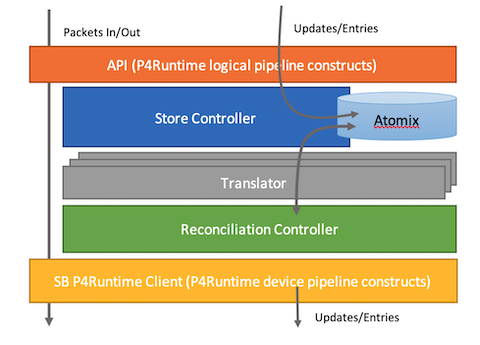

<!--
SPDX-FileCopyrightText: 2020-present Open Networking Foundation <info@opennetworking.org>

SPDX-License-Identifier: Apache-2.0
-->

# Data Plane Reconciliation Library

This piece of the µONOS architecture is provided as a library, rather than a separate component. 
The reasons for this design choice are listed at the end of this section.

The principal aim of the library is to provide µONOS components and applications with common and uniform means to 
program the behavior of the data plane using P4Runtime constructs, while remaining reasonably insulated from 
the details of a particular P4 program on the networking device, i.e. physical pipeline.

This insulation will occur by exposing a logical P4 pipeline to the applications and internally
mapping it onto the specific networking device pipeline. The logical P4 pipeline will be formally defined
as a working P4 program, which can be tested via PTF. The act of mapping the logical pipeline onto the
physical one will be the responsibility of a translation layer (see below) and translator “plugins”.

The library interface will be generalizable to any arbitrary logical pipeline and will support arbitrary roles.
Updates and entries exchanged via this interface will be “transformed” between the logical and physical pipelines.
Consequently, each transform will either have an inverse transform or the system will have means of tracking
which logical pipeline entry originated any physical pipeline entry.

To capture the original intent, the library will persist the logical (high-level) constructs specified over 
its interface rather than persisting the derived physical pipeline primitives; the latter will be (re)derived
as necessary. This will be necessary to allow physical pipeline/translator upgrades at run-time.

The following is the structure proposed for the library:

## Overview
The basic idea for the library is to expose a logical pipeline which can be programmed with the usual
P4Runtime constructs, albeit using an API that is not P4Runtime, but instead either a subset or a
look-alike for the subset of P4Runtime RPC calls. For example, there is no need to set forwarding
pipeline configuration as that will be done by the device provisioner. Similarly, application will
not need to directly negotiate mastership for its role as this will be done by the library
on behalf of (and perhaps with the participation of) the application.

## API and its Subjects
Most likely, the exposed operations will be for Read, Write and Stream. The subject of these operations
should be newly defined entities that will transparently carry various P4Runtime Entries/Updates and
contain additional status to allow the application to know which state, in the process of applying
to the data plane, those updates/entities are, e.g., pending, reconciling, applied.

Portions of the stream functionality for packet-out and packet-in are expected to remain without any augmentation.
It might also be possible to bypass any intervening layers - to be confirmed.

The API would continue to be device centric, i.e., each Read/Write operation would span only a single device.
Updates given in a single Write should be treated as a transaction, meaning that reconciler should apply all
derived entities to the device or none of them. There would be no provisions for multi-device operations and transactions.

The API will simplify the mastership arbitration process as much as possible and at the very least,
will allow the application to learn of the mastership change to allow it to tailor its own activities in response.
It remains to be seen if the application needs to participate in the mastership selection.
The library will drive the arbitration process itself.

## Store Controller
The library should persist these logical pipeline updates/entities to capture the application’s intent
and allow retrieving it later, either by the API or by the lower levels of the library.
This functionality is denoted by the Store Controller.

## Translator(s)
To transform a set of the logical pipeline constructs into another set of device pipeline-specific constructs,
they need to be subjected to pipeline-specific translation. This layer of the library will manage such
translation will offer a pipeline-agnostic API to accomplish it. The translator should provide sufficient
information to allow low-level constructs to be associated with their originating logical pipeline construct.
This is to appropriately reflect the state of the operation.

To attain run-time extensibility, the translation activities may need to be provided via side-car proxies.

## Reconciliation Controller
Once a set of pipeline-specific constructs is available, it must be applied to the device.
This will be the primary objective of the reconciliation controller. In addition to merely applying
the newly arrived operation to the data-plane, the reconciler also must make sure that the device has
in fact all the expected entries in its tables. Any departures from the expected state should be addressed
as soon as possible. The reconciliation approach should consider performance at scale characteristics
and avoid continuous polling of the state. Instead, it should kick-in only when there is a reasonable
chance that a departure may have occurred, e.g., extended connection loss or controller outage, port/link outage.

## SB P4Runtime Client
This layer may be merely the protoc-generated bindings, or it may be a thin layer built atop the former.
This client would be created and operating using the underlying connection established by the reconciler.

The low-level data plane entries are reconciled on behalf of the application using the same role and role configuration.

## Benefits of the approach
There are several benefits to the above structure. They are listed below in no particular order:
* Using P4 logical pipeline, allows us to use an existing formal definition of working P4 program that can be tested
* Same approach can be applied to different P4 logical pipelines in deployments where the pipeline used for 
  SD Fabric is not adequate/appropriate; this allows us to tailor functionality to SD Fabric, while the 
  approach can be applied outside the SD Fabric use-case
* Building this functionality as a library (as opposed to a separate component) will avoid an intervening 
  network hop for packet-out and packet-in. It also allows use of the same message-stream for mastership 
  arbitration and provides connection fate-sharing
* By partitioning the pipeline resources, each application can maintain its own store of pipeline entries,
  thus reducing the amount of data that needs to be reconciled and spreading the load between apps
  (and instances of apps via horizontal scaling). This is in contrast with ONOS classic today,
  which aggregates all flows for all devices in a single store, increasing the pressure on the store unnecessarily.
* Development of the key portions of the library can commence immediately, using an “identity” translator,
  while the logical P4 pipeline is being defined

## Caveats
For accessing shared resources, e.g., ACL tables, it may be necessary to carve off a separate component
responsible for programming & reconciling such resources
* Such component would export its own API and applications would access such shared resources indirectly
  to avoid collisions and/or complicated inter-app synchronization schemes
* Such component would still use the reconciliation library within

## Questions to address
* Does the library need to support multi-replica deployments for scaling applications?
  * Affects how/where objects need to be stored
  *	Affects southbound communication/master arbitration
* As a future priority, this library (or a similar one) should also provide means to reconcile dynamic
  configuration via gNMI (path/type/value) operations along the same mastership/role assignments; 
  yes this is in contrast with/parallel to onos-config.

